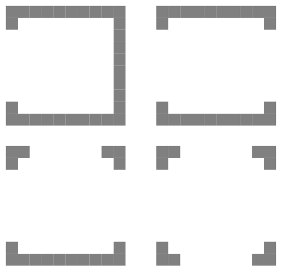

<table align="center">
  <tr>
    <th>Entire assignment is repost from my other profile</th>
  </tr>
</table>

# WEBTE2 3. Assignment SS 2022/2023

This is an assignment for the WEBTE2 course for the academic year 2022/2023.

## General Instructions
- The tasks should be optimized for the latest versions of Google Chrome and Firefox.
- Assignments are always due at midnight on the day before the class.
- Late submission of assignments will result in a reduction of points.
- Create a new database for each assignment unless stated otherwise.
- Submit the assignment as a zip file, including the parent directory. Use the naming convention `idStudent_lastname_z3.zip`.
- The zip archive should contain the following files:
  - `index.php` (main script)
  - `config.php` (configuration file placed in the same directory as `index.php`)
  - `idStudent_lastname_z3.sql` (in case of working with a database)
  - `idStudent_lastname_z3.doc` (only for technical report)

When submitting the assignment through MS Teams, make sure to include the technical report and provide the URL of your page on the school server.

## Assignment Description
The assignment focuses on utilizing websockets to create an online game called Pong. The game can be found online under the name Pong (https://www.ponggame.org/). The game should be playable by 1 to 4 players.

1. The homepage of the web application will display the game area with an ongoing game or provide the option to log in to the game with a chosen name. If the game hasn't started yet, the page will show the number of currently logged-in players.

2. After logging in, the first player who logged in will have the option to start the game. If any player doesn't want to wait for the game to start, they can leave the room. If the first player leaves, the next logged-in player will have the right to start the game. The game can also start automatically when the last player joins.

3. Upon starting the game, the game area will adjust according to the number of logged-in players (see Figure 1).

4. The objective is to move your player, represented by a moving rectangle, to prevent the ball from passing behind your side of the game area. The speed of the ball will increase as the game progresses.

5. If any player fails to catch the ball three times, they will be eliminated from the game, and their side will be replaced by a solid line, indicating that the ball will bounce off it.

6. Each player will be able to see how many times the ball has escaped their control.

7. The game will end when the last player fails to catch the ball three times.

8. During the game, keep track of and display the number of bounced balls, regardless of whether the player or the wall bounces the ball.

Remember to pay attention to the graphical appearance of the application.

-Game area for one, two, three, and four players:

## Conclusion
This assignment focuses on utilizing websockets to create an online game similar to Pong. Follow the instructions provided and make sure to implement the required functionalities. Good luck with your assignment!
